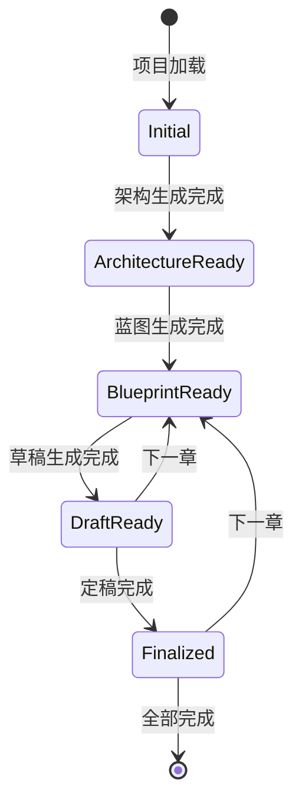

# Design Document: Web UI UX Optimization

## Overview

本设计文档描述了 AI 小说生成器 Web UI 的用户体验优化方案。优化目标是提升工作流流畅度、减少重复操作、增强智能化上下文感知能力。

主要改进包括：
- 可视化工作流步骤引导
- 章节生成自动化（章节号递增、信息自动填充）
- 编辑器自动保存
- 任务进度可视化增强
- 工作台内模型配置切换
- 文件树增强操作
- 统一的 Toast 通知系统
- 项目列表搜索和排序

## Architecture

### 系统架构概览

```
┌─────────────────────────────────────────────────────────────────┐
│                        Web UI Layer                              │
├─────────────────────────────────────────────────────────────────┤
│  Views                                                           │
│  ├── WorkbenchView (工作台主视图)                                │
│  ├── ProjectSelectView (项目选择视图)                            │
│  └── SettingsView (设置视图)                                     │
├─────────────────────────────────────────────────────────────────┤
│  Components                                                      │
│  ├── StepIndicator (新增: 步骤指示器)                            │
│  ├── RightPanel (增强: 模型配置、批量生成)                       │
│  ├── EditorPane (增强: 自动保存)                                 │
│  ├── BottomPanel (增强: 进度条、错误高亮)                        │
│  ├── FileTree (增强: 右键菜单)                                   │
│  ├── ToastContainer (新增: 统一通知)                             │
│  └── BatchGenerateModal (新增: 批量生成配置)                     │
├─────────────────────────────────────────────────────────────────┤
│  Stores (Pinia)                                                  │
│  ├── projectStore (增强: topic 字段)                             │
│  ├── taskStore (增强: 时间追踪)                                  │
│  ├── configStore (现有)                                          │
│  ├── workflowStore (新增: 工作流状态)                            │
│  └── toastStore (新增: 通知管理)                                 │
├─────────────────────────────────────────────────────────────────┤
│  Composables                                                     │
│  ├── useAutoSave (新增: 自动保存逻辑)                            │
│  ├── useChapterInfo (新增: 章节信息提取)                         │
│  └── useKeyboardShortcuts (新增: 快捷键处理)                     │
└─────────────────────────────────────────────────────────────────┘
```

### 状态流转图



## Components and Interfaces

### 1. StepIndicator 组件

新增步骤指示器组件，显示工作流进度。

```typescript
// webui/src/components/StepIndicator.vue
interface StepIndicatorProps {
  currentStep: WorkflowStep;
  completedSteps: WorkflowStep[];
}

type WorkflowStep = 'architecture' | 'blueprint' | 'draft' | 'finalize';

interface StepConfig {
  key: WorkflowStep;
  label: string;
  icon: string;
  prerequisite?: WorkflowStep;
}

const STEPS: StepConfig[] = [
  { key: 'architecture', label: '架构生成', icon: 'building' },
  { key: 'blueprint', label: '蓝图生成', icon: 'map', prerequisite: 'architecture' },
  { key: 'draft', label: '草稿生成', icon: 'edit', prerequisite: 'blueprint' },
  { key: 'finalize', label: '定稿', icon: 'check', prerequisite: 'draft' },
];
```

### 2. ToastContainer 组件

统一的通知容器组件。

```typescript
// webui/src/components/ToastContainer.vue
interface Toast {
  id: string;
  type: 'success' | 'error' | 'warning' | 'info';
  message: string;
  duration?: number; // 默认 5000ms，critical 错误不自动消失
  dismissible?: boolean;
}

interface ToastContainerProps {
  toasts: Toast[];
  position?: 'top-right' | 'top-left' | 'bottom-right' | 'bottom-left';
}
```

### 3. BatchGenerateModal 组件

批量生成配置弹窗。

```typescript
// webui/src/components/BatchGenerateModal.vue
interface BatchGenerateConfig {
  startChapter: number;
  endChapter: number;
  delayMs: number; // 每章之间的延迟
  autoFinalize: boolean; // 是否自动定稿
}

interface BatchGenerateModalProps {
  maxChapters: number;
  currentChapter: number;
}

interface BatchGenerateModalEmits {
  (event: 'submit', config: BatchGenerateConfig): void;
  (event: 'close'): void;
}
```

### 4. FileTreeContextMenu 组件

文件树右键菜单。

```typescript
// webui/src/components/FileTreeContextMenu.vue
interface ContextMenuItem {
  key: string;
  label: string;
  icon?: string;
  disabled?: boolean;
  danger?: boolean;
}

interface FileTreeContextMenuProps {
  visible: boolean;
  x: number;
  y: number;
  node: FileNode;
}

const getMenuItems = (node: FileNode): ContextMenuItem[] => {
  const items: ContextMenuItem[] = [
    { key: 'open', label: '打开', icon: 'file' },
    { key: 'rename', label: '重命名', icon: 'edit' },
    { key: 'delete', label: '删除', icon: 'trash', danger: true },
  ];
  if (node.chapterNumber) {
    items.unshift({ key: 'open-editor', label: '在编辑器中打开', icon: 'edit-2' });
  }
  return items;
};
```

### 5. 增强的 RightPanel

```typescript
// webui/src/components/RightPanel.vue (增强)
interface WorkbenchForm {
  // 现有字段
  topic: string;
  genre: string;
  numberOfChapters: string;
  wordNumber: string;
  userGuidance: string;
  chapterNumber: string;
  charactersInvolved: string;
  keyItems: string;
  sceneLocation: string;
  timeConstraint: string;
  // 新增字段
  llmConfigName: string;
  embeddingConfigName: string;
}

interface RightPanelProps {
  form: WorkbenchForm;
  workflowState: WorkflowState;
  llmConfigs: string[];
  embeddingConfigs: string[];
}

interface RightPanelEmits {
  (event: 'update:form', payload: WorkbenchForm): void;
  (event: 'run', action: string): void;
  (event: 'next-chapter'): void;
  (event: 'batch-generate'): void;
  (event: 'import-knowledge', file: File): void;
  (event: 'clear-vectorstore'): void;
}
```

### 6. 增强的 EditorPane

```typescript
// webui/src/components/EditorPane.vue (增强)
interface EditorPaneProps {
  title: string;
  subtitle?: string;
  content: string;
  saveStatus: 'saved' | 'unsaved' | 'saving';
}

interface EditorPaneEmits {
  (event: 'update:content', value: string): void;
  (event: 'save'): void;
}
```

## Data Models

### WorkflowState

```typescript
// webui/src/stores/workflow.ts
interface WorkflowState {
  currentStep: WorkflowStep;
  completedSteps: Set<WorkflowStep>;
  hasArchitecture: boolean;
  hasBlueprint: boolean;
  currentChapter: number;
  totalChapters: number;
}

type WorkflowStep = 'architecture' | 'blueprint' | 'draft' | 'finalize';
```

### ToastState

```typescript
// webui/src/stores/toast.ts
interface ToastState {
  toasts: Toast[];
  maxToasts: number; // 最多同时显示的通知数
}

interface Toast {
  id: string;
  type: 'success' | 'error' | 'warning' | 'info';
  message: string;
  createdAt: number;
  duration: number;
  critical: boolean;
}
```

### ChapterInfo (从蓝图提取)

```typescript
// webui/src/utils/chapterParser.ts
interface ChapterInfo {
  chapterNumber: number;
  title: string;
  characters: string[];
  scenes: string[];
  summary: string;
}

function parseChapterFromBlueprint(
  blueprintContent: string,
  chapterNumber: number
): ChapterInfo | null;
```

### 增强的 TaskItem

```typescript
// webui/src/stores/task.ts (增强)
interface TaskItem {
  id: string;
  label: string;
  status: TaskStatus;
  result?: Record<string, unknown>;
  error?: string;
  outputFiles?: string[];
  logs: string[];
  // 新增字段
  startedAt?: number;
  completedAt?: number;
  progress?: {
    current: number;
    total: number;
    message: string;
  };
}
```

### 增强的 Project

```typescript
// webui/src/api/types.ts (增强)
interface Project {
  id: string;
  name: string;
  genre?: string;
  num_chapters?: number;
  word_number?: number;
  topic?: string; // 新增
  created_at?: string;
  updated_at?: string;
}
```

## Correctness Properties

*A property is a characteristic or behavior that should hold true across all valid executions of a system—essentially, a formal statement about what the system should do. Properties serve as the bridge between human-readable specifications and machine-verifiable correctness guarantees.*

### Property 1: Step Advancement on Task Completion

*For any* task completion event of type T (architecture, blueprint, draft, finalize), the workflow step indicator SHALL advance to highlight the step corresponding to T+1, where T+1 is the next step in the workflow sequence.

**Validates: Requirements 1.2**

### Property 2: Button Disable State Based on Prerequisites

*For any* workflow state S where a prerequisite step P is incomplete, all buttons for steps that depend on P SHALL be disabled.

**Validates: Requirements 1.3**

### Property 3: Chapter Number Auto-Increment

*For any* chapter number N and successful completion of a draft or finalize task, the chapter number field SHALL display N+1.

**Validates: Requirements 2.1, 2.2**

### Property 4: Chapter Info Auto-Fill from Blueprint

*For any* chapter number N with available blueprint data containing character and scene information, changing the chapter number to N SHALL populate the characters_involved and scene_location fields with the extracted data.

**Validates: Requirements 3.1, 3.2, 3.3**

### Property 5: Auto-Save Debounce and Trigger

*For any* sequence of content changes, the auto-save timer SHALL reset on each change, and save SHALL be triggered exactly once after 3 seconds of no changes.

**Validates: Requirements 4.1, 4.2**

### Property 6: Unsaved Changes Indicator

*For any* editor state where the current content differs from the last saved content, the save status indicator SHALL display "未保存".

**Validates: Requirements 4.3**

### Property 7: Log Auto-Scroll Behavior

*For any* new log entry appended to the task log, the log container scroll position SHALL be at the bottom to show the latest entry.

**Validates: Requirements 5.3**

### Property 8: Task Elapsed Time Tracking

*For any* running task with startedAt timestamp T, the displayed elapsed time SHALL equal (currentTime - T) updated at regular intervals.

**Validates: Requirements 5.5**

### Property 9: Model Selection Propagation

*For any* model configuration selection (LLM or Embedding), all subsequent generation API calls SHALL include the selected configuration name in the request payload.

**Validates: Requirements 6.3**

### Property 10: Project Field Population on Load

*For any* project P with defined metadata fields (topic, genre, num_chapters, word_number), loading project P SHALL populate the corresponding form fields with P's values.

**Validates: Requirements 7.1, 7.2, 7.3, 7.4**

### Property 11: Form State Persistence

*For any* form field update, the updated value SHALL be persisted to project state within the debounce window.

**Validates: Requirements 7.5**

### Property 12: Prompt Modal Conditional Display

*For any* draft generation initiated via the "生成草稿" button, the PromptModal SHALL NOT appear unless the user explicitly requests prompt preview via "高级选项".

**Validates: Requirements 9.4**

### Property 13: Batch Generation Progress Display

*For any* batch generation of chapters from M to N, while generating chapter C, the progress display SHALL show "正在生成第 C/N 章" where the denominator is (N - M + 1).

**Validates: Requirements 10.4**

### Property 14: Project Search Filtering

*For any* search query Q, the displayed project list SHALL contain only projects whose name includes Q (case-insensitive).

**Validates: Requirements 11.2**

### Property 15: Project Sort Ordering

*For any* sort option O (name, created_at, updated_at), the project list SHALL be ordered according to O in the specified direction.

**Validates: Requirements 11.4**

### Property 16: User Preference Persistence

*For any* user preference change (sort option, model selection), the preference SHALL be persisted and restored on subsequent page loads.

**Validates: Requirements 6.4, 11.5**

### Property 17: Toast Notification Display and Auto-Dismiss

*For any* non-critical error, the toast notification SHALL auto-dismiss after 5 seconds. *For any* critical error, the toast SHALL remain until manually dismissed.

**Validates: Requirements 12.2, 12.3**

## Error Handling

### 错误分类

| 错误类型 | 处理方式 | Toast 类型 | 自动消失 |
|---------|---------|-----------|---------|
| 网络错误 | 显示重试选项 | error | 否 |
| API 错误 | 显示错误详情 | error | 5秒 |
| 验证错误 | 高亮错误字段 | warning | 5秒 |
| 任务失败 | 显示失败原因 | error | 否 |
| 保存失败 | 显示重试选项 | error | 否 |
| 成功通知 | 简短提示 | success | 3秒 |

### 错误恢复策略

1. **自动保存失败**: 保留本地内容，显示重试按钮，下次编辑时自动重试
2. **任务执行失败**: 保留任务日志，允许查看详细错误，提供重新执行选项
3. **文件加载失败**: 显示错误提示，提供刷新按钮
4. **批量生成中断**: 记录已完成章节，允许从断点继续

## Testing Strategy

### 单元测试

使用 Vitest 进行单元测试，覆盖以下模块：

1. **Store 测试**
   - workflowStore: 状态转换逻辑
   - toastStore: 通知管理逻辑
   - taskStore: 时间追踪逻辑

2. **Composable 测试**
   - useAutoSave: 防抖和保存触发
   - useChapterInfo: 蓝图解析逻辑
   - useKeyboardShortcuts: 快捷键处理

3. **工具函数测试**
   - parseChapterFromBlueprint: 章节信息提取
   - 搜索过滤逻辑
   - 排序逻辑

### 属性测试

使用 fast-check 进行属性测试，每个属性测试至少运行 100 次迭代。

测试文件命名: `*.property.test.ts`

```typescript
// 示例: workflowStore.property.test.ts
import fc from 'fast-check';
import { describe, it, expect } from 'vitest';

describe('Workflow Store Properties', () => {
  // Property 2: Button Disable State
  it('should disable dependent buttons when prerequisite incomplete', () => {
    fc.assert(
      fc.property(
        fc.record({
          hasArchitecture: fc.boolean(),
          hasBlueprint: fc.boolean(),
          hasDraft: fc.boolean(),
        }),
        (state) => {
          const result = computeButtonStates(state);
          if (!state.hasArchitecture) {
            expect(result.blueprintDisabled).toBe(true);
            expect(result.draftDisabled).toBe(true);
            expect(result.finalizeDisabled).toBe(true);
          }
          if (!state.hasBlueprint) {
            expect(result.draftDisabled).toBe(true);
            expect(result.finalizeDisabled).toBe(true);
          }
        }
      ),
      { numRuns: 100 }
    );
  });
});
```

### 组件测试

使用 Vue Test Utils 进行组件测试：

1. **StepIndicator**: 步骤渲染、高亮状态
2. **ToastContainer**: 通知显示、堆叠、消失
3. **BatchGenerateModal**: 表单验证、提交
4. **FileTreeContextMenu**: 菜单显示、选项点击

### E2E 测试

使用 Playwright 进行端到端测试：

1. 完整工作流测试: 架构 → 蓝图 → 草稿 → 定稿
2. 自动保存测试: 编辑 → 等待 → 验证保存
3. 批量生成测试: 配置 → 执行 → 取消 → 验证
4. 项目搜索排序测试
