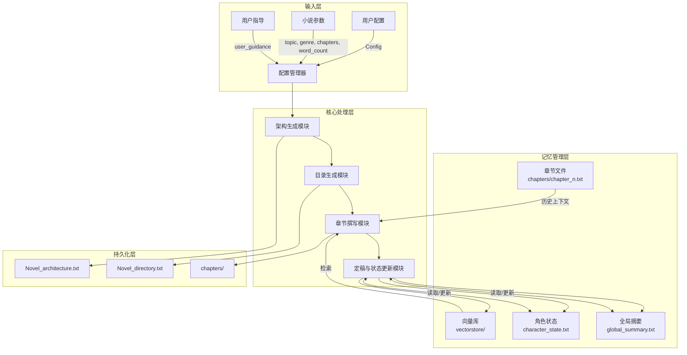

# ai-novel-web 核心逻辑架构文档

## 0. 范围与目标
- 目标：记录当前已重构完成的后端核心层架构，为后续开发和维护提供参考。
- 范围：以当前代码实现为依据，明确数据流、状态与依赖，记录核心逻辑架构。
- 说明：项目已完成 UI 与核心逻辑的分离，形成 Web UI + Backend API + 核心生成引擎的三层架构。

## 0.1 整体数据流图（概览）



## 1. 当前核心逻辑梳理

### 1.1 核心模块与职责

#### 核心生成引擎（novel_generator/）
| 模块 | 职责 |
| --- | --- |
| `architecture.py` | 小说总体架构生成（4步：核心种子→角色动力学→世界观→三幕式情节）与断点续传 |
| `blueprint.py` | 章节蓝图生成（支持分块生成与断点续写，动态计算 chunk_size） |
| `chapter.py` | 章节提示词构建、章节草稿生成（含流式）、前文摘要、知识检索与过滤 |
| `finalization.py` | 章节定稿（更新全局摘要、角色状态、向量库）、章节扩写 |
| `knowledge.py` | 知识库文本导入向量库（智能分段） |
| `vectorstore_utils.py` | 向量库初始化、加载、检索、清空、文本切分（基于 Chroma） |
| `common.py` | 通用工具：`invoke_with_cleaning`（LLM 调用+重试+清洗）、`call_with_retry`（重试机制） |

#### 后端服务层（backend/）
| 模块 | 职责 |
| --- | --- |
| `api_server.py` | FastAPI 服务器，定义所有 REST API 端点与请求/响应模型 |
| `services.py` | 业务逻辑层，编排核心生成引擎调用 |
| `project_store.py` | 项目元数据存储（JSON 文件），管理项目的创建、删除、查询 |
| `config_store.py` | 配置存储，管理 LLM/Embedding 配置 |
| `file_keys.py` | 文件路径管理，统一 file_key 到真实路径的映射 |
| `task_runtime.py` | 异步任务运行时，管理任务执行、状态、日志流 |
| `project_state.py` | 项目运行状态加载/保存 |

#### 根目录工具模块
| 模块 | 职责 |
| --- | --- |
| `llm_adapters.py` | LLM 适配器工厂（支持 OpenAI、DeepSeek、Gemini、Azure 等） |
| `embedding_adapters.py` | Embedding 适配器工厂（支持 OpenAI、Azure、Gemini、SiliconFlow） |
| `prompt_definitions.py` | 全部提示词模板 |
| `chapter_directory_parser.py` | 章节蓝图解析与章节信息提取 |
| `consistency_checker.py` | 一致性检查（LLM 审校） |
| `config_manager.py` | 配置管理（加载、保存、测试配置） |
| `utils.py` | 文件读写工具函数 |

### 1.2 关键状态与文件约定
项目状态依赖文件系统，通过 `file_keys.py` 统一管理路径映射：

| file_key | 实际路径 | 生成/更新者 | 读取者 | 说明 |
| --- | --- | --- | --- | --- |
| `architecture` | `Novel_architecture.txt` | `Novel_architecture_generate` | `Chapter_blueprint_generate`, `build_chapter_prompt` | 小说设定/核心种子/角色动力学/世界观/三幕式架构 |
| `architecture_partial` | `partial_architecture.json` | `Novel_architecture_generate` | 同上 | 架构生成断点续传 |
| `directory` | `Novel_directory.txt` | `Chapter_blueprint_generate` | `build_chapter_prompt` | 章节蓝图（每章定位/作用/悬念/伏笔/转折/简述） |
| `chapter:{N}` | `chapters/chapter_N.txt` | `generate_chapter_draft`, `finalize_chapter` | `build_chapter_prompt`, `finalize_chapter` | 章节正文 |
| `summary` | `global_summary.txt` | `finalize_chapter` | `build_chapter_prompt` | 全局摘要 |
| `character_state` | `character_state.txt` | `Novel_architecture_generate`, `finalize_chapter` | `build_chapter_prompt`, `check_consistency` | 角色状态表 |
| `plot_arcs` | `plot_arcs.txt` | 用户手动维护 | `check_consistency` | 剧情要点/未解决冲突（可选） |
| - | `vectorstore/` | `update_vector_store`, `import_knowledge_file` | `get_relevant_context_from_vector_store` | Chroma 向量库 |

项目元数据存储位置：`~/.config/.ai_novel_web/projects/projects.json`

### 1.3 核心流程（实际实现）

#### 1.3.1 架构生成（`Novel_architecture_generate`）
1. 读取 `partial_architecture.json`，作为断点数据。
2. 依次生成并持久化：
   - Step1: `core_seed_prompt`（核心种子）
   - Step2: `character_dynamics_prompt`（角色动力学）
   - Step2.5: `create_character_state_prompt`（初始角色状态，写入 `character_state.txt`）
   - Step3: `world_building_prompt`（世界观）
   - Step4: `plot_architecture_prompt`（三幕式情节）
3. 合并为 `Novel_architecture.txt`。
4. 删除 `partial_architecture.json`。

#### 1.3.2 章节蓝图生成（`Chapter_blueprint_generate`）
1. 读取 `Novel_architecture.txt`。
2. 计算分块大小（`compute_chunk_size`）：
   - `tokens_per_chapter = 200`
   - `chunk_size = (floor(max_tokens/200/10)*10) - 10`
   - 限制在 `[1, min(max_chunk_size, number_of_chapters)]`，`max_chunk_size` 默认 30
   - `max_tokens` 上限为 8192
3. 若 `Novel_directory.txt` 已存在，解析已完成章节号，从下一章继续生成。
4. 生成方式：
   - 单次生成：`chapter_blueprint_prompt`（章节数 <= chunk_size）
   - 分块生成：`chunked_chapter_blueprint_prompt`（仅保留最近 100 章目录做上下文）
5. 写入 `Novel_directory.txt`。

#### 1.3.3 章节提示词构建（`build_chapter_prompt`）
1. 读取 `Novel_architecture.txt`、`Novel_directory.txt`、`global_summary.txt`、`character_state.txt`。
2. 解析当前章与下一章信息（`get_chapter_info_from_blueprint`）。
3. 第一章：直接使用 `first_chapter_draft_prompt`。
4. 非第一章：
   - 读取前 3 章文本（`get_last_n_chapters_text`）。
   - 生成"当前章节摘要"（`summarize_recent_chapters_prompt`）。
   - 获取前一章结尾 800 字。
   - 生成检索关键词（`knowledge_search_prompt`），解析 `·` 分隔关键词（最多 5 组）。
   - 向量库检索（`get_relevant_context_from_vector_store`），按关键词分组检索并合并。
   - 应用内容规则（`apply_content_rules`）：根据章节时间距离标记 [SKIP]/[MOD40%]/[OK]/[PRIOR]。
   - 知识过滤与重组（`knowledge_filter_prompt` + `get_filtered_knowledge_context`）。
5. 组装 `next_chapter_draft_prompt` 并返回提示词。

#### 1.3.4 章节草稿生成（`generate_chapter_draft` / `generate_chapter_draft_stream`）
1. 使用 `build_chapter_prompt` 生成提示词（或使用 `custom_prompt_text`）。
2. 调用 LLM 生成正文（支持流式输出）。
3. 保存到 `chapters/chapter_N.txt`。

#### 1.3.5 章节定稿（`finalize_chapter`）
1. 读取章节文本、`global_summary.txt`、`character_state.txt`。
2. 生成并更新：
   - `summary_prompt` → `global_summary.txt`
   - `update_character_state_prompt` → `character_state.txt`
3. 按句子切分（NLTK `sent_tokenize`，max_length=500）并更新向量库（`update_vector_store`）。

#### 1.3.6 章节扩写（`enrich_chapter_text`）
对章节文本进行扩写，使其更接近每章字数，保持剧情连贯。

#### 1.3.7 知识库导入（`import_knowledge_file`）
1. NLTK 分段（`advanced_split_content`，500 字符上限）。
2. 初始化或追加向量库。

#### 1.3.8 一致性检查（`check_consistency`）
基于 `CONSISTENCY_PROMPT`，对设定、角色状态、摘要、剧情要点与章节做检查。

### 1.4 架构解耦说明
当前实现已完成 UI 与核心逻辑的分离：

1. **前端（webui/）**：Vue 3 + TypeScript，通过 REST API 与后端交互，不直接访问文件系统。
2. **后端 API（backend/api_server.py）**：FastAPI 服务，承接请求参数校验、任务调度、文件访问。
3. **业务服务层（backend/services.py）**：编排核心生成引擎调用，处理配置解析。
4. **核心生成引擎（novel_generator/）**：纯生成逻辑，接收 `filepath` 参数，不依赖 UI。
5. **基础设施**：LLM/Embedding 适配器、文件存储、向量库（Chroma）。

前端通过 `file_key`（如 `architecture`, `directory`, `chapter:12`）访问文件，避免路径泄漏。

## 2. 当前实现架构

### 2.1 分层架构
当前采用三层架构：

1. **前端层（webui/）**
   - Vue 3 + TypeScript + Pinia 状态管理
   - 通过 REST API 与后端交互
   - 不直接访问文件系统或向量库

2. **后端服务层（backend/）**
   - FastAPI 提供 REST API
   - 任务运行时管理异步任务
   - 配置存储与项目元数据管理

3. **核心生成引擎（novel_generator/ + 根目录工具）**
   - 纯生成逻辑，接收 `filepath` 参数
   - LLM/Embedding 适配器
   - 向量库（Chroma）

### 2.2 实际包结构
```
ai-novel-web/
├── webui/                      # 前端 Web UI
│   ├── src/
│   │   ├── api/               # API 客户端
│   │   ├── components/        # UI 组件
│   │   ├── stores/            # Pinia 状态管理
│   │   ├── router/            # Vue Router
│   │   └── utils/             # 工具函数
│   └── ...
├── backend/                    # 后端服务层
│   ├── api_server.py          # FastAPI 服务器与路由
│   ├── services.py            # 业务逻辑编排
│   ├── project_store.py       # 项目元数据存储
│   ├── config_store.py        # 配置存储
│   ├── file_keys.py           # 文件路径映射
│   ├── task_runtime.py        # 异步任务运行时
│   └── project_state.py       # 项目状态管理
├── novel_generator/            # 核心生成引擎
│   ├── architecture.py        # 架构生成
│   ├── blueprint.py           # 章节蓝图生成
│   ├── chapter.py             # 章节草稿生成
│   ├── finalization.py        # 章节定稿
│   ├── knowledge.py           # 知识库导入
│   ├── vectorstore_utils.py   # 向量库操作
│   └── common.py              # 通用工具
├── llm_adapters.py             # LLM 适配器工厂
├── embedding_adapters.py       # Embedding 适配器工厂
├── prompt_definitions.py       # 提示词模板
├── chapter_directory_parser.py # 章节蓝图解析
├── consistency_checker.py      # 一致性检查
├── config_manager.py           # 配置管理
└── utils.py                    # 文件读写工具
```

### 2.3 API 端点概览
后端提供以下 REST API（`backend/api_server.py`）：

| 端点 | 方法 | 功能 |
| --- | --- | --- |
| `/api/projects` | GET/POST | 列表/创建项目 |
| `/api/projects/{id}` | GET/DELETE | 获取/删除项目 |
| `/api/projects/{id}/files/{file_key}` | GET/PUT | 读取/更新项目文件 |
| `/api/projects/{id}/chapters` | GET | 列出所有章节 |
| `/api/projects/{id}/chapters/{num}` | GET/PUT/DELETE | 章节 CRUD |
| `/api/projects/{id}/generate/architecture` | POST | 生成架构（异步任务） |
| `/api/projects/{id}/generate/blueprint` | POST | 生成蓝图（异步任务） |
| `/api/projects/{id}/generate/build-prompt` | POST | 构建提示词（异步任务） |
| `/api/projects/{id}/generate/draft` | POST | 生成草稿（异步任务） |
| `/api/projects/{id}/generate/finalize` | POST | 定稿章节（异步任务） |
| `/api/projects/{id}/generate/enrich` | POST | 扩写章节（异步任务） |
| `/api/projects/{id}/generate/batch` | POST | 批量生成（异步任务） |
| `/api/projects/{id}/consistency-check` | POST | 一致性检查（异步任务） |
| `/api/projects/{id}/knowledge/import` | POST | 导入知识库（异步任务） |
| `/api/projects/{id}/vectorstore/clear` | POST | 清空向量库（异步任务） |
| `/api/tasks/{task_id}` | GET | 获取任务状态 |
| `/api/tasks/{task_id}/stream` | GET | SSE 流式日志 |
| `/api/tasks/{task_id}/cancel` | POST | 取消任务 |
| `/api/config/llm` | GET/POST | LLM 配置管理 |
| `/api/config/embedding` | GET/POST | Embedding 配置管理 |
| `/api/config/choose` | GET/PUT | 任务配置选择 |

### 2.4 请求/响应模型（Pydantic）
```python
# 架构生成请求
ArchitectureRequest:
    topic: str
    genre: str
    number_of_chapters: int
    word_number: int
    user_guidance: Optional[str]
    llm_config_name: Optional[str]

# 蓝图生成请求
BlueprintRequest:
    number_of_chapters: int
    user_guidance: Optional[str]
    llm_config_name: Optional[str]

# 草稿生成请求
DraftRequest:
    novel_number: int
    word_number: int
    characters_involved: Optional[str]
    key_items: Optional[str]
    scene_location: Optional[str]
    time_constraint: Optional[str]
    user_guidance: Optional[str]
    custom_prompt_text: Optional[str]
    llm_config_name: Optional[str]
    embedding_config_name: Optional[str]
    retrieval_k: Optional[int]

# 批量生成请求
BatchRequest:
    start_chapter: int
    end_chapter: int
    word_number: int
    min_word: Optional[int]
    auto_enrich: Optional[bool]
    resume_existing: Optional[bool]
    delay_seconds: Optional[float]
    # ... 其他章节参数

# 任务响应
TaskResponse:
    task_id: str
```

### 2.5 任务运行时
`TaskManager`（`backend/task_runtime.py`）管理异步任务：
- 任务状态：`pending` | `running` | `success` | `failed`
- 支持任务取消
- SSE 流式日志输出
- 任务结果与输出文件追踪

### 2.6 文件路径映射
`file_keys.py` 定义 file_key 到实际路径的映射：
```python
FILE_KEY_MAP = {
    "architecture": "Novel_architecture.txt",
    "architecture_partial": "partial_architecture.json",
    "directory": "Novel_directory.txt",
    "summary": "global_summary.txt",
    "character_state": "character_state.txt",
    "plot_arcs": "plot_arcs.txt",
}
# 章节路径：chapters/chapter_{N}.txt
```

## 3. 已实现的关键特性

1. **Project ID 与路径映射**
   - `ProjectStore` 管理项目元数据，`project_id` 映射到 `root_path`
   - 前端不接触真实路径，通过 `file_key` 访问文件

2. **LLM/Embedding 配置管理**
   - `ConfigStore` 管理多套 LLM/Embedding 配置
   - `choose_configs` 为不同任务（architecture/blueprint/draft 等）指定默认配置
   - 支持运行时配置测试

3. **异步任务系统**
   - `TaskManager` 管理所有生成任务
   - 支持任务状态查询、取消、SSE 流式日志
   - 任务类型：architecture, blueprint, build_prompt, draft, finalize, enrich, batch, consistency, knowledge_import, vectorstore_clear

4. **断点续传**
   - 架构生成：`partial_architecture.json` 保存中间状态
   - 蓝图生成：解析已有 `Novel_directory.txt`，从下一章继续

5. **批量生成**
   - 支持指定章节范围批量生成
   - 支持跳过已存在章节（`resume_existing`）
   - 支持自动扩写（`auto_enrich`）
   - 支持生成间隔延迟（`delay_seconds`）

6. **知识库与向量检索**
   - Chroma 向量库存储章节内容与外部知识
   - 智能关键词生成与多组检索
   - 内容规则过滤（避免近章重复）

## 4. 技术栈

| 层级 | 技术 |
| --- | --- |
| 前端 | Vue 3, TypeScript, Pinia, Vite |
| 后端 | FastAPI, Pydantic, uvicorn |
| LLM 集成 | LangChain, 多适配器（OpenAI/DeepSeek/Gemini/Azure） |
| 向量库 | Chroma, LangChain Embeddings |
| 文本处理 | NLTK (sent_tokenize) |

## 5. 注意事项

1. **NLTK 依赖**
   - `sent_tokenize` 依赖 `punkt` 数据包
   - 代码中下载已注释，部署时需确保环境已安装：`nltk.download('punkt')`

2. **向量库并发**
   - 向量库更新未做并发控制
   - 多用户并发写入可能造成数据一致性问题

3. **日志与隐私**
   - `invoke_with_cleaning` 会打印 prompt/response 到日志
   - 生产环境需通过 logger 控制日志级别

4. **配置安全**
   - API Key 存储在后端配置文件
   - 前端不直接持久化敏感信息

5. **分块参数**
   - `compute_chunk_size` 使用 `tokens_per_chapter = 200` 估算
   - `max_tokens` 上限 8192，`max_chunk_size` 默认 30

## 6. 结论

项目已完成核心逻辑与 UI 的分离重构，形成清晰的三层架构：
- **前端**：Vue 3 Web UI，通过 REST API 交互
- **后端**：FastAPI 服务，提供任务管理与配置存储
- **核心引擎**：纯生成逻辑，支持多 LLM 适配器与向量检索

当前架构支持：
- 多项目管理
- 异步任务执行与监控
- 断点续传与批量生成
- 知识库导入与智能检索
- 一致性检查

为后续多用户、云端部署等扩展打好了结构基础。
